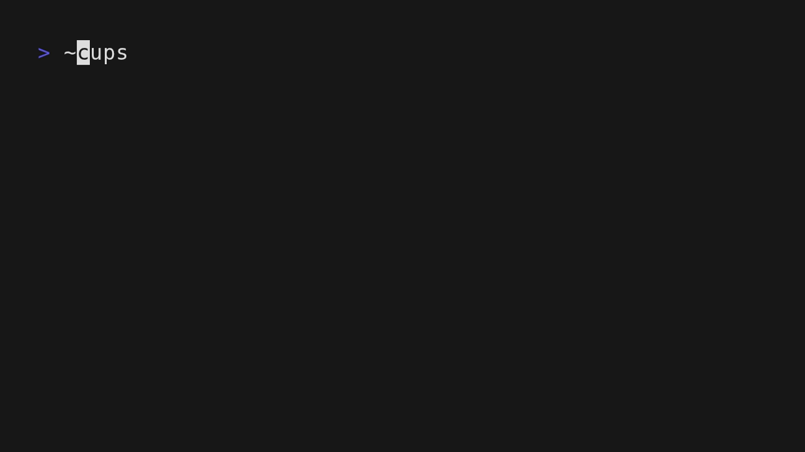

# godsays
ASDASD

An homage to Terry A. Davis and TempleOS. Displays a random bible verse from the King James Bible based on the current time. 

## Usage

Run with:

```
nix run
```

## Development

This project uses Nix flakes. Enter the dev shell with:

```
direnv allow
```

Then build or run with cabal:

```
cabal build
cabal run
```
